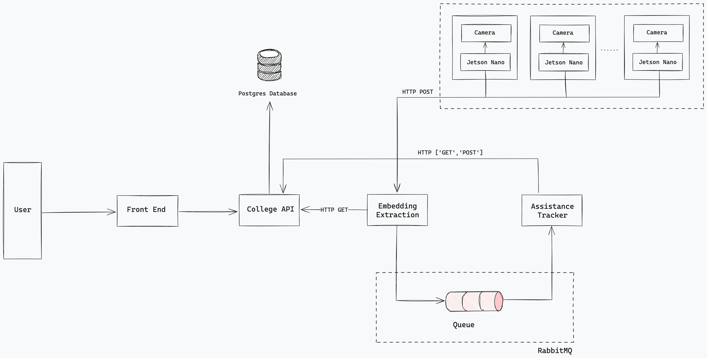

# ATTENDANCE MONITORING SYSTEM

This projects is a PoC (Proof of Concept) of a automated attendance control system for educactional institutions. It consists of multiple embedded systems that preprocess data before sending it to the server, to reduce the amount of data being sent (by extracting all detected faces and sending only the resized images of each face) 




## Directory Structure
As there are multiple microservices, there may be some difference between them, it was aimed to maintain a common based strcuture as shown below:

```
├── Microservice            <- Microservice folder  
|   ├── src                 <- Source code for use in the microservice  
|   ├── tests               <- Scripts for testing microservices  
|   ├── Dockerfile          <- File to build docker image  
|   ├── requirements.txt    <- The requirements file for installing all dependencies  
├── README.md               <- Top level README file  
├── docker-compose.yml      <- File to run (Server Microservices + PostgresDB + RabbitMQ)
```


## Installation

The microservices were developed using: 
- Python 3.11.5

**Instalation using Docker Compose:** If you want to test the whole system, you can use the docker-compose.yml file to build it:

```bash
$ docker-compose up
```

For testing each microservice, you can either: 
1. Build and run the Docker Image
```bash
$ cd microservice_name
# Build the image
$ docker build -t .
# Run the container
$ docker run --name <container_name> <image_name>
```

2. Install dependencies and run the main script for each microservice